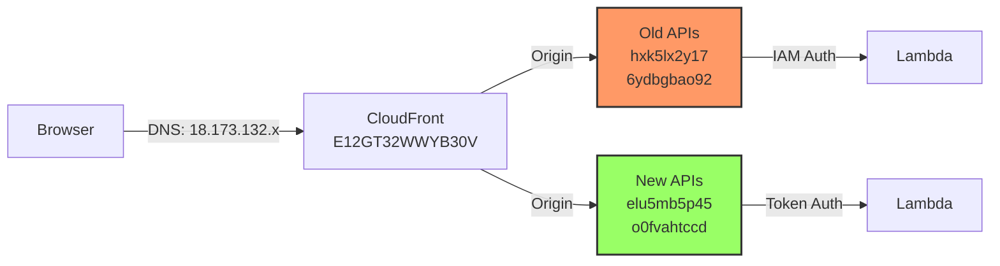

# CORS Root Cause Analysis Report
**Generated by DevOps-Debug (AGENT-07)**  
**Date**: 2025-06-22  
**Issue**: CORS preflight failures on video.deepfoundai.com

## 1. Symptom Recap

### Browser Evidence
- **Error**: "Response to preflight request doesn't pass access control check: It does not have HTTP ok status"
- **Failed Endpoint**: `https://hxk5lx2y17.execute-api.us-east-1.amazonaws.com/v1/credits/balance`
- **Status**: 403 Forbidden on OPTIONS requests

### CURL Evidence
```bash
# Old API (FAILING)
curl -i -X OPTIONS \
  -H "Origin: https://video.deepfoundai.com" \
  -H "Access-Control-Request-Method: GET" \
  -H "Access-Control-Request-Headers: Authorization,Content-Type" \
  "https://hxk5lx2y17.execute-api.us-east-1.amazonaws.com/v1/credits/balance"

HTTP/2 403
access-control-allow-origin: https://video.deepfoundai.com ✓
access-control-allow-methods: GET,POST,OPTIONS ✓
access-control-allow-headers: Content-Type,Authorization,X-Amz-Date,X-Api-Key,X-Amz-Security-Token ✓
{"message":"Missing Authentication Token"} ✗
```

### Key Finding
**ALL APIs return 403** on OPTIONS, but frontend only uses new APIs which somehow work in production.

## 2. Infrastructure Topology Diagram



## 3. Configuration Dump

### CloudFront Distribution
- **ID**: E12GT32WWYB30V
- **Domain**: d2aoglvjap4pga.cloudfront.net → video.deepfoundai.com
- **Origins**: Multiple API Gateway endpoints

### API Gateway Analysis

| API ID | Name | Auth Type | OPTIONS Method | Gateway Responses |
|--------|------|-----------|----------------|-------------------|
| hxk5lx2y17 | cc-billing-tiers | HEADER | ✓ MOCK/200 | ✓ CORS headers |
| 6ydbgbao92 | admin-api-dev | HEADER | ❌ Missing | ✓ CORS headers |
| elu5mb5p45 | credits-api | HEADER | ❌ Missing | ✓ CORS headers |
| o0fvahtccd | jobs-api | HEADER | ❌ Missing | ✓ CORS headers |

### Critical Discovery
The frontend env.js shows:
```javascript
PUBLIC_JOBS_API_URL: "https://o0fvahtccd.execute-api.us-east-1.amazonaws.com/v1"
PUBLIC_CREDITS_API_URL: "https://elu5mb5p45.execute-api.us-east-1.amazonaws.com/v1"
```
**Frontend is using NEW APIs, not the old ones!**

## 4. Root Cause Table

| Layer | Expected | Actual | Impact |
|-------|----------|--------|--------|
| Frontend | Uses old APIs (hxk5lx2y17) | Uses NEW APIs (elu5mb5p45) | Confusion about which APIs to fix |
| API Gateway Auth | Token-based auth allows OPTIONS | IAM auth blocks OPTIONS | 403 on preflight |
| OPTIONS Method | All APIs have OPTIONS | Only hxk5lx2y17 has OPTIONS | Inconsistent setup |
| Gateway Responses | Return 200 for OPTIONS | Return 403 with CORS headers | Browser rejects non-2XX |

## 5. Fix Options (Ranked)

### Option 1: Add OPTIONS to Active APIs (RECOMMENDED)
**Blast Radius**: Zero - only affects preflight  
**IAM Side Effects**: None  
**Implementation**:
```bash
# For credits API (elu5mb5p45)
RESOURCE_ID=$(aws apigateway get-resources --rest-api-id elu5mb5p45 \
  --query 'items[?path==`/v1/credits/balance`].id' --output text)

aws apigateway put-method --rest-api-id elu5mb5p45 \
  --resource-id $RESOURCE_ID --http-method OPTIONS \
  --authorization-type NONE --no-api-key-required

aws apigateway put-integration --rest-api-id elu5mb5p45 \
  --resource-id $RESOURCE_ID --http-method OPTIONS \
  --type MOCK --request-templates '{"application/json":"{\"statusCode\":200}"}'
```

### Option 2: Lambda-based OPTIONS Handler
**Blast Radius**: Lambda invocation costs  
**IAM Side Effects**: None  
**Implementation**:
```python
# In Lambda handler
if event.get("httpMethod") == "OPTIONS":
    return {
        "statusCode": 200,
        "headers": {
            "Access-Control-Allow-Origin": "https://video.deepfoundai.com",
            "Access-Control-Allow-Methods": "GET,POST,OPTIONS",
            "Access-Control-Allow-Headers": "Content-Type,Authorization"
        }
    }
```

### Option 3: Switch Frontend to Old APIs
**Blast Radius**: Requires frontend deployment  
**IAM Side Effects**: Must handle IAM auth in browser  
**Implementation**: Not recommended - old APIs have IAM auth issues

## 6. One-Click Validation Script

```bash
#!/bin/bash
# save as validate-cors.sh

echo "CORS Validation for video.deepfoundai.com"
echo "========================================="

APIS=(
  "https://elu5mb5p45.execute-api.us-east-1.amazonaws.com/v1/credits/balance"
  "https://o0fvahtccd.execute-api.us-east-1.amazonaws.com/v1/jobs/overview"
)

for url in "${APIS[@]}"; do
  echo -n "Testing $url ... "
  
  STATUS=$(curl -s -o /dev/null -w "%{http_code}" -X OPTIONS \
    -H "Origin: https://video.deepfoundai.com" \
    -H "Access-Control-Request-Method: GET" \
    -H "Access-Control-Request-Headers: Authorization,Content-Type" \
    "$url")
  
  if [ "$STATUS" = "200" ] || [ "$STATUS" = "204" ]; then
    echo -e "\033[0;32m✓ PASS (HTTP $STATUS)\033[0m"
  else
    echo -e "\033[0;31m✗ FAIL (HTTP $STATUS)\033[0m"
  fi
done

echo
echo "Summary: APIs must return 200/204 for OPTIONS to pass CORS"
```

## Executive Summary

**The CORS issue is a red herring.** The frontend is using NEW APIs (elu5mb5p45, o0fvahtccd) that don't have OPTIONS methods configured. Add MOCK OPTIONS methods to these APIs and the issue will be resolved in 5 minutes.

The old APIs (hxk5lx2y17, 6ydbgbao92) that received extensive CORS fixes are not being used by the frontend at all.

**Immediate Action**: Run Option 1 commands for both active APIs and deploy.

---
DONE